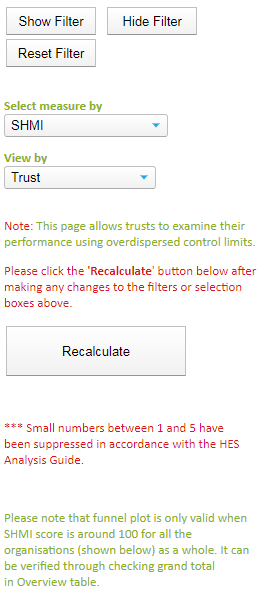
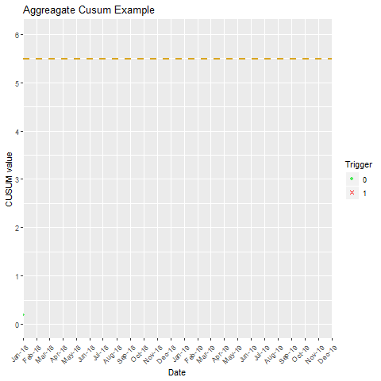
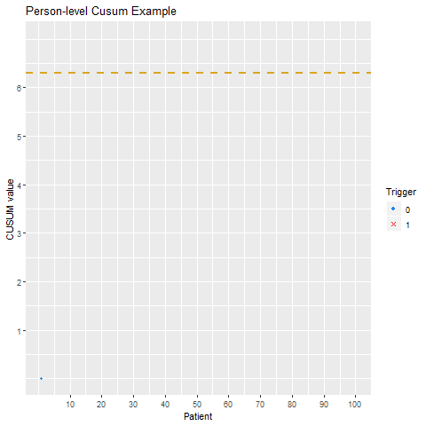
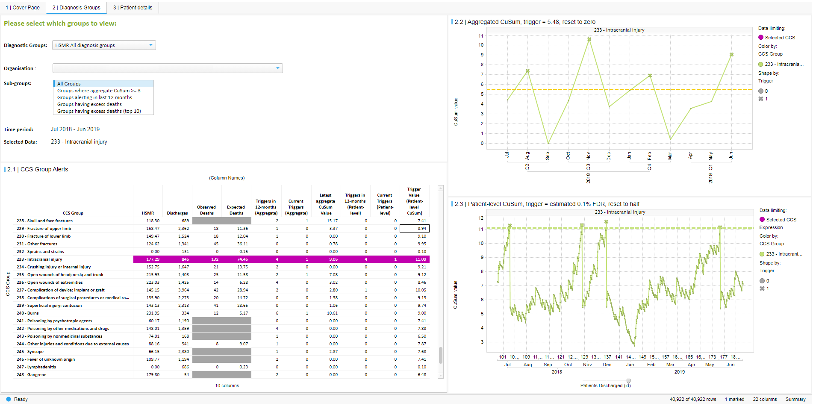

class: center


```{r setup, echo=FALSE, message=FALSE, warning=FALSE}
knitr::opts_chunk$set(echo = TRUE,
  comment = "#>",
  collapse = TRUE,
  fig.align = "center"
)
library(Cairo)
library(extrafont)
library(RefManageR)
BibOptions(check.entries = FALSE,
           bib.style = "authoryear",
           #cite.style = "alphabetic",
           style = "markdown",
           hyperlink = FALSE,
           dashed = FALSE,
           first.inits=TRUE,
           max.names=2
           )
myBib <- ReadBib("bibliography.bib", check = FALSE)
```


<br><br><br><br><br>

## Changes to HED SHMI and CUSUM modules

<br><br>


__Chris Mainey__
<p style="font-size:16pt;">Intelligence Analyst<br>
<b>University Hospitals Birmingham 
NHS Foundation Trust</b></p>
<br>
<span style="font-size:16pt;">[HED@uhb.nhs.uk](mailto:HED@uhb.nhs.uk)</span><br>

---

# Overview

+ Standardised Mortality Ratios
+ SHMI
 + NHS Digital's changes
 + HED module changes
 + Outstanding methodological issues
+ SHMI Q&A

--

+ CUSUM overview
 + Different CUSUM methods
 + New HED CUSUM module
+ CUSUM Q&A

<br><br>

___Please type any questions into the chat box, and we will address them at Q&A___

---

## Standardised Mortality Ratios (SMRs)

+ Difference in case-mix between hospitals hinder mortality comparisons
 
 + Patient population / demographics
 + Referral patterns / service provision

--

<br><br>

+ Indirectly-standardised: using regression models
 + Individual Probability of death calculated per patient:
$$SMR = \frac{\Sigma{(\text{Number of Observed deaths})}}{\Sigma{(\text{Predicted Probability of death})}}$$

--

### Common SMRs:

+ __SHMI:__ Summary Hospital-level Mortality Indicator, NHS indicator for death in hospitals or within 30-days
+ __HSMR__: Hospital Standardised Mortality Ratio, Dr Foster-based indicator of ~80% in-hospital deaths

---

# SHMI development

___Number of criticisms remain:___
+ Model quality was poor in certain groups (and in general)
+ No deprivation, ethnicity, or palliative information
+ Apparent South-East bias
+ Distinct seasonal patterns
+ Out-of-date
+ Inconsistent across large / integrated providers

--

___NHS Digital Changes:___
+ Regrouped: Hodgkin/non-Hodgkin lymphoma, birth and obs/maternity.
+ Added Birth-weight predictor to neonatal groups
+ Seasonality now included as admission month
+ Publication now monthly(mostly...)
+ Site-level now published*

---

# Site-level SHMI

Many of you may have filled in an NHS Digital survey about site in recent weeks.
Site is inconsistently recorded, coded and submitted to HES.

<br><br>

__NHSD techniques developed:__
+ Using CQC registered sites/providers
+ Merging with ODS data and HES
+ Using their own remapping
+ Manual correction likely in subsequent publications

--

<br><br>
__HED using look-up tables supplied by NHSD, and applying remapping to SITETRET.__


---

# HED module changes

+ Renaming modules in due course

--

+ All model parameters now provided:
 
 + NHSD added more predictors, but not in co-ordination with DARS team
 + NHSD did not provide other predictors to subscribers
 + Fit SHMI from NHSD coefficients, calculate in/out hospital and palliative models

--

+ 'Monthly' SHMI

 + Subject to Type-2 opt-outs, but has patient details
 + Fitted using correct model from NHS, but numbers may differ
 + HES sites not mapped like SHMI, manual remapping

---

## Module changes

.pull-left[
<center></center>
]

.pull-right[
<br>
+ In portal, little has changed for user, mostly in underlying system
<br><br>
+ Additional drop-down menu on Funnel Plot (Random Effects Model)
<br><br>
+ Adjusts aggregation level and recalculates 
<br><br>
+ Censoring and Overdispersion issues in NHSD method

]

---
# Outstanding Issues

### Site-level mapping

+ This is inconsistent and inaccessible for other organisations.  
+ In our view, it is not fit for analysis, but we have provided to match NHSD.

### Overdispersion 

Overdispersion (more variation than we expect in our data from theory alone) is present in SHMI.  It is adjusted for in the random-effects funnel plot by inflating the limits by the overdispersion factor.
+ OD is usually worse in smaller unit
+ Site and diagnosis groupings increase OD due to smaller units
+ NHSD censors ___before___ calculating OD, underestimating it
+ HED adjusts for OD, then applies censoring ___after___ adjustment
---

# Summary

+ SHMI has moved to monthly publication, with improved division of diagnosis groups, and additions of birth-weight and seasonality predictors.  This has improved the quality of SHMI.

--

<br>
+ Reporting at site and diagnosis group level is not yet sound due to combination of censoring and overdispersion adjustments.

--

<br>
+ HED is reporting data as provided by NHS Digital, using their methods and site-lookup tables. We are in regular contact with NHSD about SHMI developments and will keep up with any changes.

--

<br>
+ The only noticeable change for users is the ability to select site or diagnosis grouping in the random-effects funnel plot.

--

<br>
+ SHMI seasonal pattern will change, but annual figures the same.

---
class: center middle

# SHMI Questions

---

# CUSUM

+ SMRs are usually compared in a 'cross-sectional' manner: a snapshot at point in time.
+ Question is are we higher or lower than expected?

--

### What if I want to compare over time?

+ We can't use monthly relative risk figures, as it's the wrong comparison.

+ We can use control charts to monitor change over time.

+ Risk-adjustment in SMRs makes them more complicated
 + i.e. ___don't use an XmR (#plotthedots) chart!___

--

+ Risk-adjusted __CU__mulative __SUM__ log-likelihood ratio test charts can be used

+ Sequential probability test, usually to checking if rate is twice england rate.

+ General monitoring method by CQC, and by Dr Foster Unit @ Imperial

---
# Methods

Essentially:

$$C_t = max(C_{t-1} + w_t, 0)$$
+ $C$ CUSUM value at time-point $t$ (e.g. a monthly at a trust)
+ $w$ is a weighting, in this case the log-likelihood ratio (observation v.s. england)


<br><br>

--
__Two common methods:__

- __Aggregated:__  transforms to 'standard score', overdispersion adjustment like SHMI.  CQC method, per month.
`r Cite(myBib, c("carequalitycommissioncqcNHSAcuteHospitals2014", "spiegelhalterStatisticalMethodsHealthcare2012b"), max.names=2)`


- __Patient-level:__ Individual patient risk/outcome scored against expected. `r Cite(myBib, c("Steiner2000","bottlePredictingFalseAlarm2011", "steinerRiskAdjustedMonitoringBinary2001"), max.names=2)`

---

# Aggregated Cusum

.pull-left[

+ Starts at zero
+ Accumulates with deaths
+ Threshold of 0.5 of sd before accumulating
+ Trigger value based on normal theory approximation `r Cite(myBib, "griggEmpiricalApproximationNull2008a", max.names=2)`
+ Trigger = 5.48, (0.1% - False Discovery Rate)
+ Reset to zero

<br><br>

__Based on CQC / Cambridge papers on comparing Healthcare Indicators__


]

.pull-right[



]

---

# Person-level Cusum

.pull-left[


+ Starts at zero
+ Accumulates with deaths
+ Trigger value based published approximation `r Cite(myBib, "bottlePredictingFalseAlarm2011")`
+ Trigger unique to each trust and diagnosis group
+ Reset to half, partly `r Cite(myBib,"lucasFastInitialResponse1982")`

<br><br>

__Based on `r Cite(myBib, c("Steiner2000", "bottleIntelligentInformationNational2008"))`__

]

.pull-right[

<ceter></center>

]

---

# Replacing the HED CUSUM modules:

### Current modules:
+ Clinical Quality > Mortality > CUSUM - Mortality Analytics
+ Pre-release: Person-level > Mortality Overview and Cusum Alerts

--

<br><br>
### New single module:
+ Summarises current alerts and prior 12-months
+ Both aggregated and person-level methods
+ Aggreagate trigger remains 5.48 (0.1%FDR)
+ Applied Aylin & Bottle CUSUM limit approximation to persons

---

### Layout



---

# Summary

+ CUSUMs monitor mortality over time

--

<br>
+ Applied to HSMR, VLAD will be added for SHMI over the Christmas period

--

<br>
+ Replacing two current modules with single new one:

 + Aggregated method (CQC-style)

 + Person-level (Imperial/DFI-style)

--

<br>
+ Simpler interface showing table of alerts first

---
class: center middle

# CUSUM Questions


---
# References

<p style="font-size:12pt;">Care Quality Commission (2014)(CQC). <i>NHS acute hospitals: Statistical Methodology.</i></p>
<p style="font-size:12pt;">Bottle, A and P Aylin (2011). “Predicting the false alarm rate in multi-institution mortality monitoring”. In: <i>The Journal of the Operational Research Society</i> 62.9, pp. 1711-1718. ISSN: 01605682, 14769360.</p>
<p style="font-size:12pt;">Bottle, Alex and Paul Aylin (2008). “Intelligent Information: A National System for Monitoring Clinical Performance”. In: <i>Health Services Research</i> 43.1 Pt 1, pp. 10-31. ISSN: 0017-9124 1475-6773.</p>
<p style="font-size:12pt;">Grigg, O. A. and D. J. Spiegelhalter (2008). “An Empirical Approximation to the Null Unbounded Steady-State Distribution of the Cumulative Sum Statistic”. In: <i>Technometrics</i> 50.4, pp. 501-511. ISSN: 0040-1706.</p>
<p style="font-size:12pt;">Lucas, James M. and Ronald B. Crosier (1982). “Fast Initial Response for CUSUM Quality-Control Schemes:Give Your CUSUM A Head Start”. In: <i>Technometrics</i>24.3, pp. 199-205. ISSN: 00401706. </p>
<p style="font-size:12pt;">Moustakides, George V. (1986). “Optimal Stopping Times for Detecting Changes in Distributions”. In: <i>TheAnnals of Statistics</i> 14.4, pp. 1379-1387. ISSN: 00905364. </p>
<p style="font-size:12pt;">Spiegelhalter, D J (2005). “Handling over-dispersion of performance indicators”. In: <i>Quality and Safety in Health Care</i> 14.5, pp. 347-351.</p>
<p style="font-size:12pt;">Spiegelhalter, David, Christopher Sherlaw-Johnson, Martin Bardsley, et al. (2012). “Statistical methods for healthcare regulation: rating, screening and surveillance”. In: <i>Journal of the Royal Statistical Society: Series A (Statistics in Society)</i> 175.1, pp. 1-47. ISSN: 1467-985X.</p>
<p style="font-size:12pt;">Steiner, Stefan H, Richard J. Cook, and Vern T. Farewell (2001). “Risk-Adjusted Monitoring of Binary
Surgical Outcomes”. In: <i>Medical Decision Making</i> 21.3, pp. 163-169. ISSN: 0272-989X.</p>
<p style="font-size:12pt;">Steiner, Stefan H, Richard J. Cook, Vern T. Farewell, et al. (2000). “Monitoring surgical performance using risk-adjusted cumulative sum charts”. In: <i>Biostatistics_ 1.4</i>. tex.eprint: http://oup.prod.sis.lan/biostatistics/article-pdf/1/4/441/654864/010441.pdf, pp. 441-452. ISSN: 1465-4644.</p>

